# Orbit: Implementation

This document explains how Orbit works: the architecture, how up to ten browsers find each other and connect,
how media, chat and captions flow, what is kept on the device, and how it is tested and deployed.
Screenshots come from a deployment (`npm run screenshots`); the green frames are Chrome's synthetic test camera.

- [1. Goals](#1-goals)
- [2. User flow](#2-user-flow)
- [3. Architecture](#3-architecture)
- [4. Rooms and names](#4-rooms-and-names)
- [5. Signaling with Supabase Realtime](#5-signaling-with-supabase-realtime)
- [6. The mesh: one peer connection per person](#6-the-mesh-one-peer-connection-per-person)
- [7. Media handling and bandwidth](#7-media-handling-and-bandwidth)
- [8. Data channel protocol](#8-data-channel-protocol)
- [9. Captions and transcript](#9-captions-and-transcript)
- [10. Home page and local cache](#10-home-page-and-local-cache)
- [11. NAT traversal: STUN and TURN](#11-nat-traversal-stun-and-turn)
- [12. UI layer](#12-ui-layer)
- [13. Error handling](#13-error-handling)
- [14. Testing](#14-testing)
- [15. Deployment](#15-deployment)
- [16. Debugging notes](#16-debugging-notes)
- [17. Limitations and next steps](#17-limitations-and-next-steps)

---

## 1. Goals

| Goal | Decision |
| --- | --- |
| Group calls in the browser, no installs or accounts | WebRTC full mesh, rooms named by anything the user types |
| No backend to run | Supabase Realtime for signaling, Netlify static hosting plus one function |
| Media never touches our servers | Peer-to-peer `RTCPeerConnection`s, with TURN only as an encrypted relay |
| A record of the call without recording it | Browser speech recognition, shared as text, saved only on the device |
| Small, readable codebase | Vanilla TypeScript + Vite, one module per responsibility |

## 2. User flow

### Home

A greeting for the time of day ("Good evening, Asha. Welcome back."), a clock, one field that accepts any
room name, number or link, and **Start a room** for a random code. The **Jump back in** card lists recent
rooms with when you were last there, for how long and with how many people, plus rejoin, transcript download
and remove. All of it comes from local storage.

| Desktop | Mobile |
| --- | --- |
| 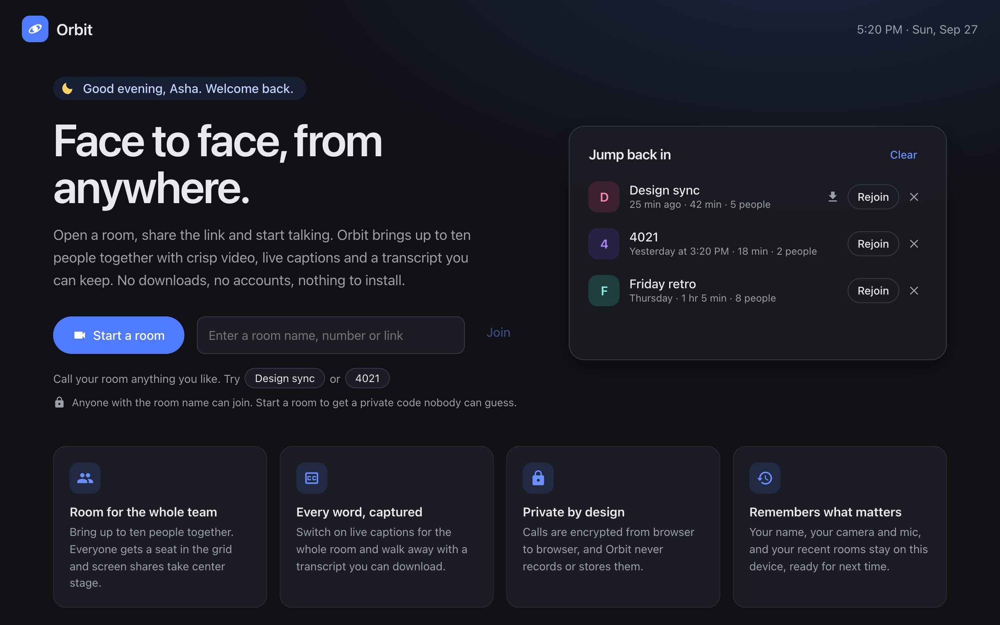 | 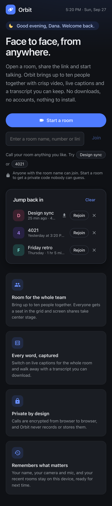 |

Marketing copy lives in `src/ui/copy.ts`, and a unit test enforces the house style: no semicolons and no
dashes of any kind (hyphen, en dash, em dash, minus) in user-facing home page text.

### Lobby

A mirrored camera preview, camera and microphone pickers, a live mic level meter and a display name. The
name and device choices (including whether the camera or mic was on) are remembered for next time.

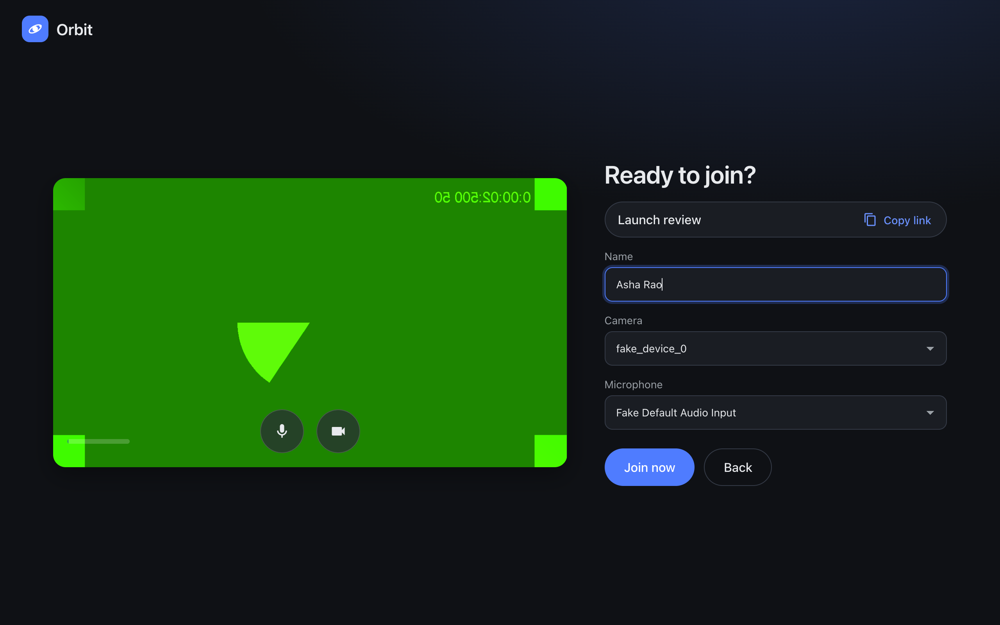

### Waiting

The first person in sees the room name and a copy-link button.


### In the call

Everyone gets a tile. The layout adapts to the room:

| People | Layout |
| --- | --- |
| 1 | Your own tile, full size |
| 2 | The other person fills the stage, your self-view floats in a corner |
| 3 to 10 | Grid with `ceil(√n)` columns (one or two columns on phones) |
| Someone presenting | Spotlight: the shared screen takes the stage, everyone else in a strip (desktop only) |

A ring lights up around whoever is talking, and a badge shows any tile whose connection is still coming up.

| Four people | Phone |
| --- | --- |
| 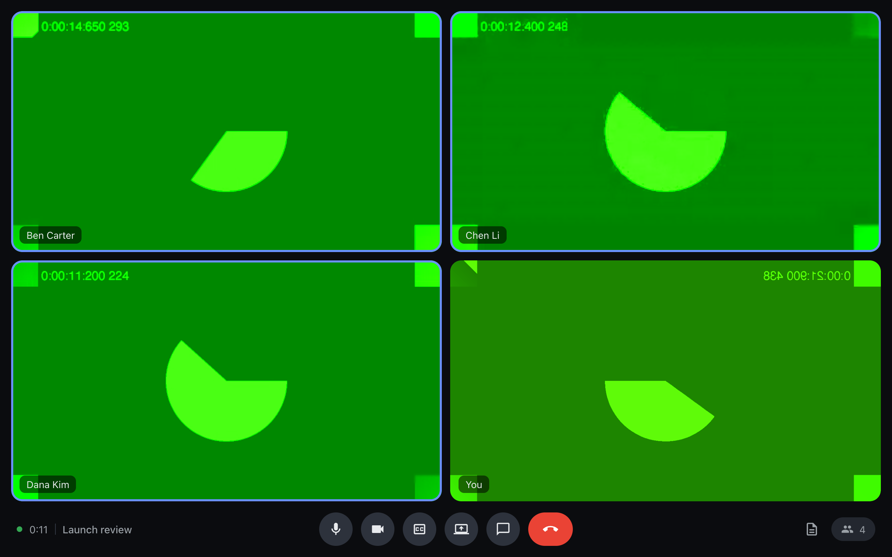 | 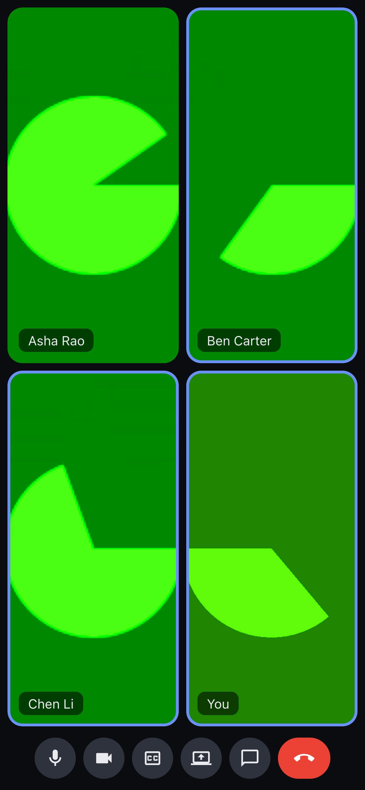 |

### Captions, transcript and chat

The **CC** button turns captions on for the whole room, and a "Transcribing" pill tells everyone.
Captions appear at the bottom of the stage; the side panel has **Chat** and **Transcript** tabs, and the
transcript can be downloaded at any time.

| Live captions | Transcript | Chat |
| --- | --- | --- |
| 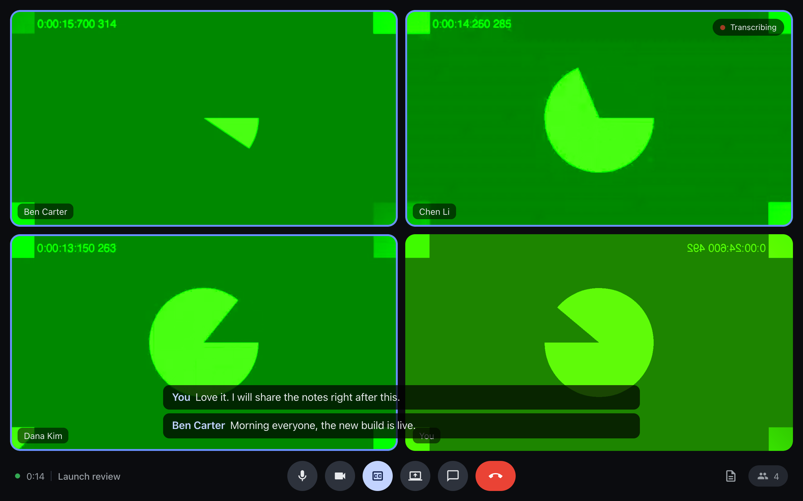 | 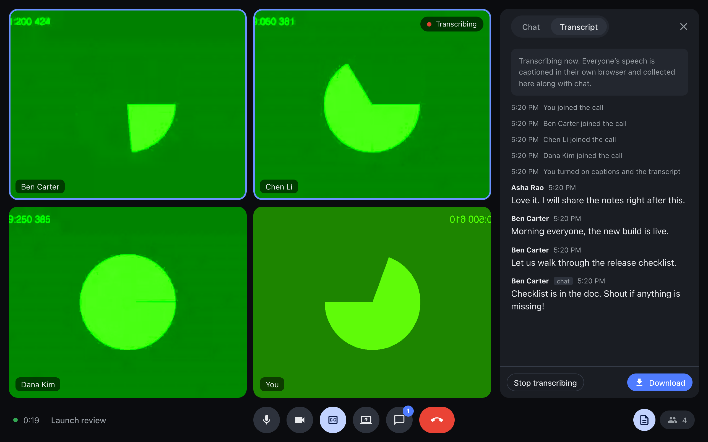 | 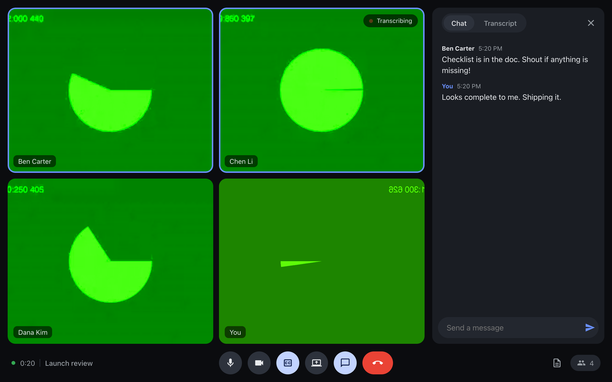 |

### Leaving

The end screen offers Rejoin and, when there is one, **Download transcript**. The room and its transcript are
added to the home page.

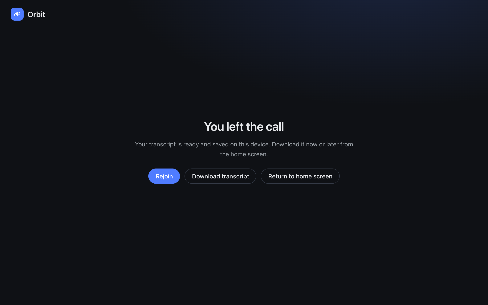

## 3. Architecture

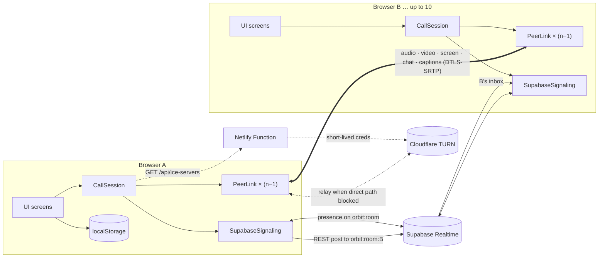

### Module map

| File | Responsibility |
| --- | --- |
| `src/main.ts` | Router: config check, then home, lobby, call and end screens; records visits and call summaries |
| `src/config.ts` | Reads `VITE_*` env; default STUN; optional static TURN |
| `src/room.ts` | Room name normalisation, room keys, links, random room codes |
| `src/roster.ts` | Pure function that decides who is admitted, who is turned away, and who is "polite" in each pair |
| `src/signaling.ts` | Presence on the room channel, per-person inboxes, ordered REST sends |
| `src/ice.ts` | Fetches TURN credentials from `/api/ice-servers`, with fallback |
| `src/peer.ts` | `PeerLink`: one `RTCPeerConnection`, perfect negotiation, data channel, candidate batching, encodings |
| `src/call-session.ts` | `CallSession`: the mesh, local media, captions, transcript and stall watchdog, for the UI |
| `src/bandwidth.ts` | Video bitrate, resolution and frame rate for a given room size |
| `src/media.ts` | `getUserMedia` / `getDisplayMedia`, device lists, level meter, friendly errors |
| `src/messages.ts` | Validated chat, state, caption and transcription messages |
| `src/speech.ts` | `Captioner`: Web Speech API wrapper with auto restart and backoff |
| `src/transcript.ts` | Ordered, de-duplicated transcript entries, text formatting, file download |
| `src/storage.ts` | `OrbitStore`: name, device choices, recent rooms and saved transcripts in local storage |
| `src/time.ts` | Relative times, durations and the part of the day for greetings |
| `src/ui/*` | Home, lobby, call (tiles, speaking monitor) and message screens, plain DOM via a tiny `h()` helper |
| `netlify/functions/ice-servers.mts` | Trades the Cloudflare TURN key for expiring credentials |

`CallSession` is the only thing the call screen talks to. It exposes intent methods (`toggleMic`,
`toggleCamera`, `toggleScreenShare`, `sendChat`, `setTranscription`, `hangUp`) and reports back through
handlers (`onStatus`, `onParticipants`, `onLocalMedia`, `onChat`, `onNotice`, `onCaption`,
`onTranscription`, `onTranscript`).

## 4. Rooms and names

A room can be called anything: `Design sync`, `4021`, `Équipe produit`. `normalizeRoomName()`:

- pulls `?room=` out of a pasted Orbit link,
- removes control and invisible formatting characters, collapses whitespace and trims,
- caps the name at 60 characters without splitting an emoji or accented letter.

The name is shown exactly as typed, but the channel is keyed by `roomKey()` (Unicode NFC, lower case), so
`Design Sync` and `design sync` meet in the same room. Links use `?room=<name>` with standard URL encoding.
**Start a room** still generates a random `abc-defg-hjk` code from an alphabet without look-alike characters.

## 5. Signaling with Supabase Realtime

Nothing is persisted. For a room with key `k`:

- **`orbit:k`** carries **presence only**. Each tab tracks `{ joinedAt }` under a random per-tab id.
- **`orbit:k:<id>`** is that person's **inbox**. Only they subscribe to it.

To signal someone, a browser posts `{ from, to, payload }` to the recipient's inbox with
`channel.httpSend()` (Realtime's REST broadcast endpoint). Sends to each peer go through their own promise
queue, so an offer is always delivered before its ICE candidates. Payloads are an SDP description, a batch of
ICE candidates, `reset` or `bye`.

The first version broadcast every signal on the shared room channel with a `to` field. That is fine for two
people, but in a mesh every message reaches everyone: ten people negotiating 45 connections turned into
thousands of deliveries in a few seconds, messages were dropped under Realtime's rate limits, and peers
received ICE candidates for offers that never arrived. Inboxes make each signal a single delivery.

### Admission

On every presence `sync`, `resolveRoster()` sorts people by `joinedAt` (ties broken by id) and admits the
first ten (`ROOM_CAPACITY`). It returns `pending` until our own presence has echoed back, `full` if we are not
among the first ten, or `admitted` with each peer and whether we are the **polite** side of that pair
(`selfId < peerId`, so both ends agree without talking). Admission is sticky: once in, a later roster change
never evicts you.

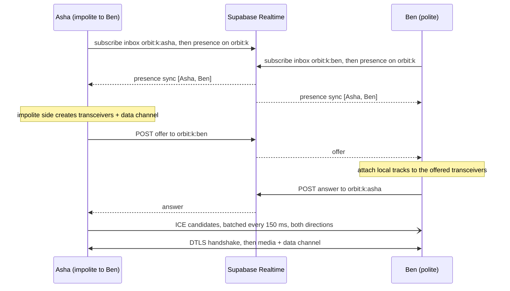

The inbox is subscribed **before** presence is tracked, so nobody can signal us before we are listening.

## 6. The mesh: one peer connection per person

`CallSession` keeps a `PeerLink` for each admitted peer. Every pair negotiates independently with the
[perfect negotiation](https://developer.mozilla.org/en-US/docs/Web/API/WebRTC_API/Perfect_negotiation)
pattern (`makingOffer`, `ignoreOffer`, polite rollback).

- Only the **impolite** side creates the audio and video transceivers and the data channel, so each
  connection has exactly one audio, one video and one data section.
- The **polite** side binds its tracks to the offered transceivers (`direction = 'sendrecv'` + `replaceTrack`) before answering.
- **Every media change uses `sender.replaceTrack()`** on all links: mute, camera and screen share never renegotiate.
- Incoming signals are applied through a promise queue, strictly in order. On `failed` the link calls `restartIce()`.
- ICE candidates are batched for 150 ms (and flushed at end of gathering) to cut signaling traffic.

Robustness details:

- **Signal before presence:** an offer can arrive before the sender's presence syncs. The session connects to
  the sender instead of dropping it, up to the room's capacity.
- **Stall watchdog:** the impolite side of each pair checks after 15 seconds. If that connection has never come
  up, it sends `reset` and both ends replace just that `PeerLink` with a fresh one, keeping the person's name
  and state. At most three resets per pair. Because sends to a peer are ordered, the `reset` always lands
  before the new offer.
- **Departures:** `bye` (on hang-up and `pagehide`) or the peer vanishing from presence closes that link.
  Departed ids are ignored from then on, so late candidates cannot resurrect them.
- **Status:** the call is `connected` if any peer is, `reconnecting` if someone dropped, otherwise `connecting`
  or `waiting`. Each tile shows its own connection health.

## 7. Media handling and bandwidth

| Action | Implementation |
| --- | --- |
| Join with partial devices | `acquireMedia` tries camera + mic, then mic only, then camera only, and reports the first real error |
| Remembered devices | The saved camera and mic ids are requested as `ideal`, so a missing device falls back instead of failing |
| Mute | `track.enabled = false` (instant unmute, no permission prompt) |
| Camera off | `track.stop()` + `replaceTrack(null)` on every link, so the camera light really turns off |
| Screen share | `getDisplayMedia` → `replaceTrack(screen)`; the browser's "Stop sharing" restores the camera |
| Speaking ring | One shared `AudioContext`; each remote and local audio track gets an `AnalyserNode`, polled every 120 ms, with a 600 ms hold |

In a mesh each person uploads one copy of their video per peer, so `videoEncodingFor(peers, isScreen)` sets
the sender's `maxBitrate`, `scaleResolutionDownBy` and `maxFramerate` whenever the room size changes:

| Peers | Camera | Screen share |
| --- | --- | --- |
| 1 | 1.5 Mbps, full resolution | 2.5 Mbps |
| 2 to 3 | 900 kbps, ÷1.5 | 1.2 Mbps |
| 4 to 5 | 550 kbps, ÷2, 24 fps | 700 kbps |
| 6 to 9 | 350 kbps, ÷3, 20 fps | 450 kbps |

Screen shares are never downscaled, so text stays sharp. With nine peers that is about 3 Mbps of upload for
camera video, which a typical home or office connection can carry. Encodings are applied again once a link
connects, because senders reject parameters before negotiation.

## 8. Data channel protocol

JSON messages over one ordered `RTCDataChannel` per pair (`src/messages.ts`):

```ts
type PeerMessage =
  | { type: 'chat'; id: string; text: string; sentAt: number }
  | { type: 'state'; name: string; media: { audio: boolean; video: boolean; screen: boolean } }
  | { type: 'caption'; id: string; text: string; final: boolean; at: number }
  | { type: 'transcription'; on: boolean; at: number; by: string };
```

- `state` is sent when a channel opens and after every media change. It drives the name tag, muted badge,
  camera-off avatar and the spotlight layout.
- A newcomer is greeted on channel open with our `state` and the room's current `transcription` setting.
- Everything received is untrusted. `decodeMessage` validates types, strips unknown fields, caps chat at
  2000 characters, captions at 1000 and names at 40, and rejects blank messages. The UI only sets `textContent`.

## 9. Captions and transcript

**Room-wide switch.** `transcription { on, at, by }` is last-writer-wins by `at`, so if two people toggle at
once, everyone converges on the same answer. It is also sent to each newcomer.

**Captioning.** While transcription is on, each browser runs a `Captioner` (Web Speech API) on its own
microphone only, so nobody's audio is sent anywhere by Orbit. Interim and final results are sent to every
peer as `caption` messages keyed by `<session>-<index>`, so an interim line is replaced in place by its final
text. The captioner pauses while you are muted, restarts after the browser's silence timeouts with a backoff
from 250 ms to 8 s, and stops with a clear message if permission is denied or the language is unsupported.

**Transcript.** `Transcript` collects final speech, chat and events ("Ben joined", "Asha turned on captions")
in time order and de-duplicates by id. Remote timestamps are clamped to within 60 seconds of the local clock,
so a peer with a wrong clock cannot reorder the record. `formatTranscript()` produces:

```text
Orbit transcript
Room: Launch review
Date: Sunday, September 27, 2026 at 5:16 PM
Your name: Asha Rao
Speakers: Ben Carter, Asha Rao

[17:16:02] · Ben Carter joined the call
[17:16:09] · You turned on captions and the transcript
[17:16:11] Ben Carter: Morning everyone, the new build is live.
[17:16:14] Ben Carter (chat): Checklist is in the doc. Shout if anything is missing!
```

The file is downloaded from a `Blob` as `Orbit transcript - <room> - YYYY-MM-DD HH.MM.txt`. When a call ends,
the transcript (if it has any content) is saved on the device and linked from the room's home page entry.

## 10. Home page and local cache

`OrbitStore` (`src/storage.ts`) wraps `localStorage`:

| Key | Contents | Limit |
| --- | --- | --- |
| `orbit:name` | Display name | 40 characters |
| `orbit:devices` | Camera and mic ids, and whether each was on | |
| `orbit:recent-rooms` | Name, first and last visit, visit count, last duration, peak people, transcript id | 12 rooms |
| `orbit:transcripts` | Saved transcript text per call | 10 transcripts, 200k characters each |

Everything read back is validated, so a corrupted or hand-edited value is ignored rather than breaking the
page. Writes tolerate quota errors, and Orbit keeps working (without memory) when storage is disabled. The
home page listens for the `storage` event, so a call ending in another tab updates the list.

The greeting uses the part of the day (morning, afternoon, evening, or "Up late" at night) and says
"Welcome back" once you have a history. The sun or moon icon follows the same rule.

## 11. NAT traversal: STUN and TURN

- **STUN** (Google, and Cloudflare via the function) lets peers discover their public address. That is
  enough for most home networks.
- **TURN** relays packets when no direct path exists. `/api/ice-servers` calls Cloudflare's
  `generate-ice-servers` API with a server-side token and returns credentials valid for 6 hours:
  - URLs on port 53 are filtered out, because browsers block them and they would only time out.
  - Requests whose `Origin` is not the Orbit site (or localhost) get `403`.
  - The client (`src/ice.ts`) validates the response and falls back to static STUN on error, missing
    config or a 4-second timeout.

## 12. UI layer

- No framework: a ~20-line `h(tag, props, ...children)` helper builds DOM nodes. Each screen is a
  `mount(container) → cleanup` function, and `main.ts` swaps screens.
- `main.call[data-status]` and `main.call[data-layout]`, plus `data-connection` on each tile, drive CSS and
  make end-to-end tests easy to write.
- `VideoTile` owns one participant's video, avatar, name tag, muted badge and health badge, and only touches
  the DOM when something changed.
- Accessibility: labelled buttons with `aria-pressed` state, `aria-live` toasts, chat and captions, keyboard shortcuts.
- Responsive: breakpoints at 1000, 860 and 560 px. On phones the grid drops to one or two columns, the side
  panel becomes a full-height sheet, and `env(safe-area-inset-bottom)` keeps the controls clear of the home indicator.

## 13. Error handling

| Situation | What the user sees |
| --- | --- |
| Supabase env missing | Setup screen listing the missing variables |
| Signaling unreachable or timed out | "Could not join the call" with Rejoin |
| Camera/mic permission denied, missing or busy | Specific message in the lobby; can still join without that device |
| Eleventh person | "This room is full" (a room they had never visited is not added to their recents) |
| Someone leaves | Toast "Ben left the call"; their tile goes and the grid reflows |
| Network drop | "Reconnecting…" on that tile plus automatic ICE restart |
| Connection never comes up | Watchdog rebuilds that one peer connection |
| Speech recognition unsupported | A toast explains this browser can't caption your voice, but you still see everyone else's captions |
| Microphone permission for captions blocked | Captioning stops with a message; the call carries on |
| Screen-share picker cancelled | Silently ignored |

## 14. Testing

**Unit tests** (`npm test`, Vitest, 82 tests) cover the pure logic:

| File | Covers |
| --- | --- |
| `room.test.ts` | Free-form names, Unicode, links, control characters, length cap, case-insensitive keys |
| `roster.test.ts` | Admission order, capacity of ten, sticky admission, politeness symmetry, tie-breaks |
| `bandwidth.test.ts` | Encoding tiers by room size, screen shares never downscaled |
| `messages.test.ts` | Round-trips for every message type, malformed payloads, truncation |
| `transcript.test.ts` | Ordering, de-duplication, formatting, file names |
| `storage.test.ts` | Recent rooms, limits, corrupted data, quota errors, missing storage |
| `time.test.ts` | Relative times, durations, part of the day |
| `copy.test.ts` | Every home page string is free of semicolons and dashes |
| `config.test.ts`, `ice.test.ts` | Env parsing, TURN endpoint success, errors and timeout fallback |

**End-to-end**, all against a real deployment with Chrome's synthetic camera and microphone:

- `npm run e2e`: two separate Chrome instances hold a 1:1 call (join, video both ways, audio, names, chat,
  mute, camera off/on, hang up). 10 steps.
- `npm run e2e:group`: `PEOPLE` participants (default 4) join a room with a free-form name, then the test checks
  that everyone is connected to everyone, names and headcount, grid layout, chat, room-wide captions, a
  caption from Ben reaching everyone (speech recognition is faked in headless Chrome), the downloaded
  transcript's contents, and that the rest stay connected when someone leaves and the leaver's home page lists
  the room with its transcript. With `PEOPLE=10` it also sends an eleventh person, who must see "This room is
  full" while everyone else still counts ten.

Participants run as isolated browser contexts in one Chrome. Results on the preview deployment:

| Run | Result |
| --- | --- |
| 1:1 | 10/10 steps, about 9 s |
| 6 people with video | 9/9 steps, connected about 1 s after the last person joins |
| 10 people, `CAMERA=off` | 10/10 steps, including the eleventh person being turned away |

Ten people **with video** cannot be simulated on one laptop: that is 90 video encoders and 90 decoders on one
machine, and the test browsers could not even load the page. In real use each person's device only carries
its own nine streams in each direction.

## 15. Deployment

- **Netlify** builds with `npm run build` and publishes `dist/` (`netlify.toml`). The response headers set
  `Permissions-Policy` for camera, microphone and display capture, plus `nosniff` and a referrer policy.
- `VITE_SUPABASE_URL` and `VITE_SUPABASE_ANON_KEY` are inlined at build time (public by design).
  `CF_TURN_KEY_ID` and `CF_TURN_API_TOKEN` are runtime-only secrets for the function.
- Branches are checked on a preview alias (`netlify deploy --build --alias <name>`) before merging.

## 16. Debugging notes

**WARP and the first 1:1 test.** The first end-to-end run on the live site failed with perfect signaling but
both sides stuck in "Connecting…". Instrumenting `RTCPeerConnection` showed every candidate pair stuck
`in-progress`, and a bare loopback page reproduced it without Orbit. The machine runs Cloudflare WARP, which
interferes with peer-to-peer UDP. Adding Cloudflare TURN through a Netlify function took the test from 0/1
to 15/15 checks. Locally the same applies: plain `vite` has no `/api/ice-servers`, so tests use `netlify dev`.

**Ten people and lost offers.** The first 10-person run failed with peers logging
`addIceCandidate: The remote description was null`, meaning candidates arrived for offers that never did.

1. The room channel was carrying every signal to every participant, which multiplied traffic by the room size.
   Signals moved to per-person inboxes over REST, queued per peer (section 5).
2. A benchmark from Node showed Realtime's REST endpoint comfortably handling 90 parallel posts in 3 seconds,
   yet in the test browsers some posts still took over 10 seconds. The laptop was the bottleneck: ten full
   Chrome instances pushed the load average past 50 on 12 cores with memory compressed, and endpoint security
   software was using two cores inspecting traffic.
3. The group test now runs each person as an isolated context in one Chrome, and the stall watchdog rebuilds
   any connection that slips through. The full 10-person room then passed, with the watchdog visibly
   recovering two stalled pairs along the way.

**Mobile home overflow.** A grid column sized `1fr` grew to fit a long unwrapped line on phones;
`minmax(0, 1fr)` fixed it.

## 17. Limitations and next steps

- **Mesh ceiling.** Ten is a sensible limit for a mesh: each person uploads nine video streams. Larger rooms
  would need an SFU such as Cloudflare Calls or LiveKit, which forwards one upload to everyone.
- **No room access control.** Knowing the name is enough. Options: host approval ("knock"), or signed room tokens.
- **Captions depend on the browser.** Firefox has no speech recognition; Chrome sends audio to Google's service.
  An on-device model (Whisper in WebGPU) would remove both limits.
- **Credential refresh.** TURN credentials last 6 hours; longer calls would need `setConfiguration()` with fresh credentials.
- Possible features: in-call device switching, background blur, a call quality indicator from `getStats()`,
  and transcript export as Markdown or subtitles.
