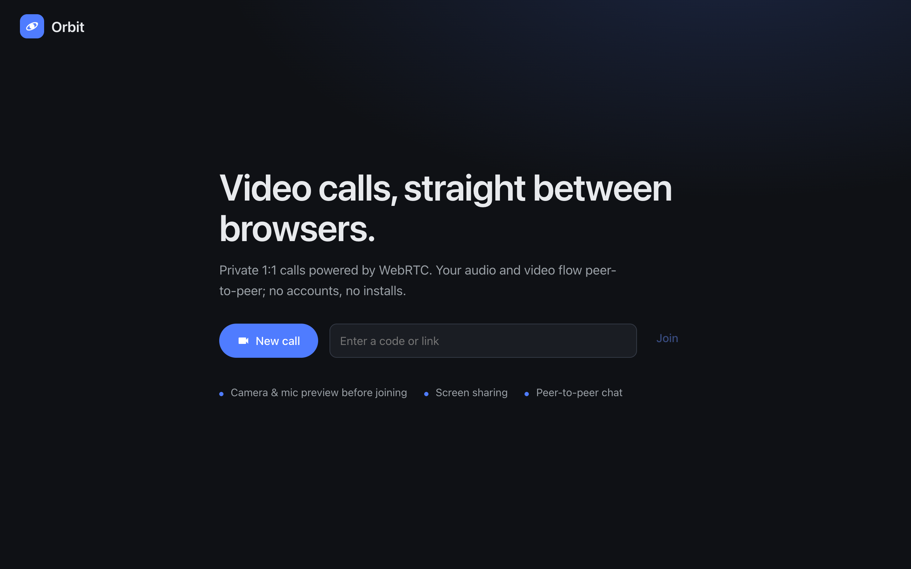
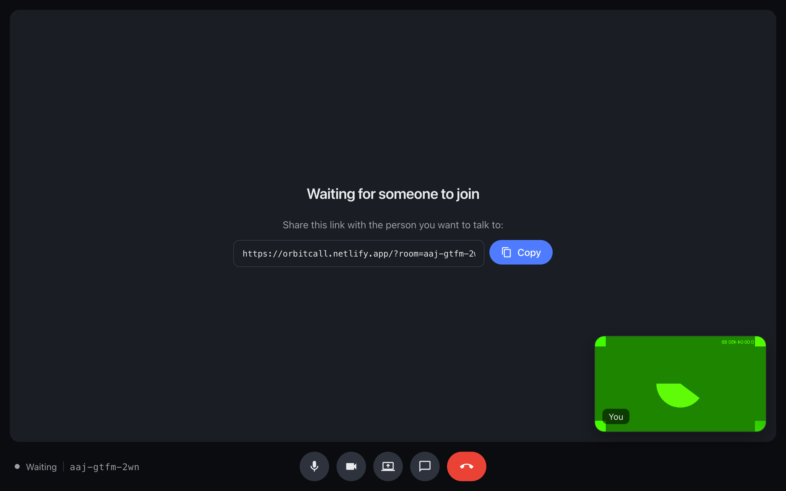
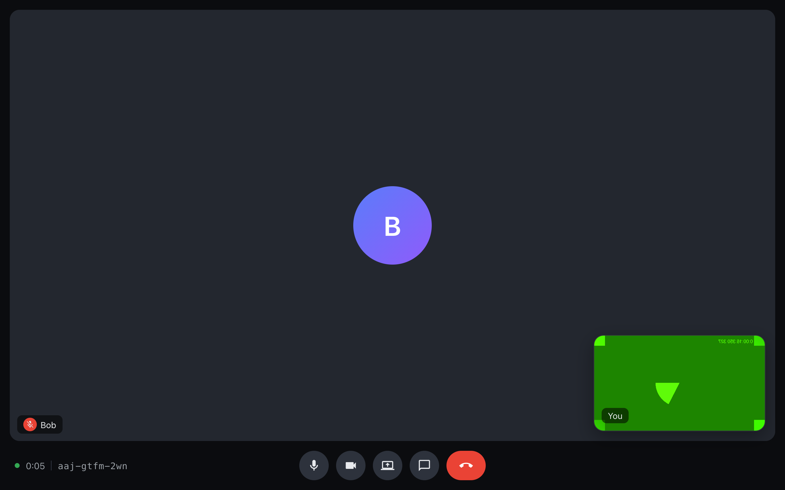
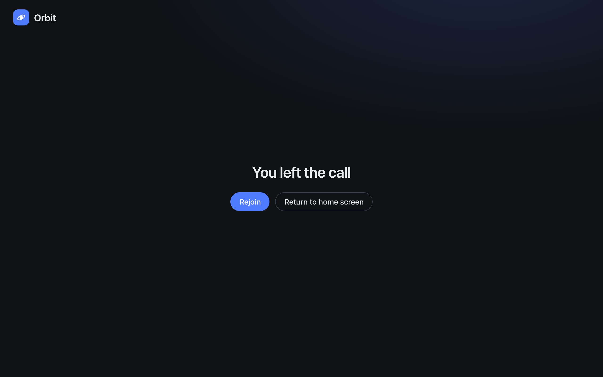
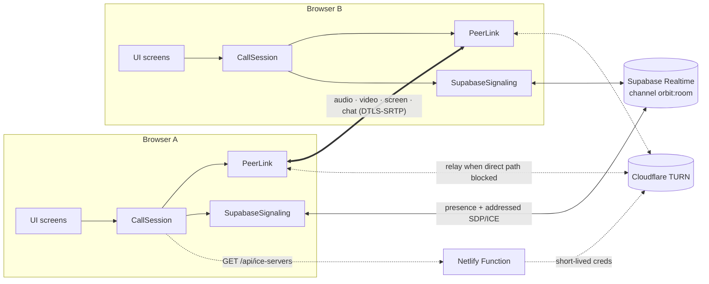
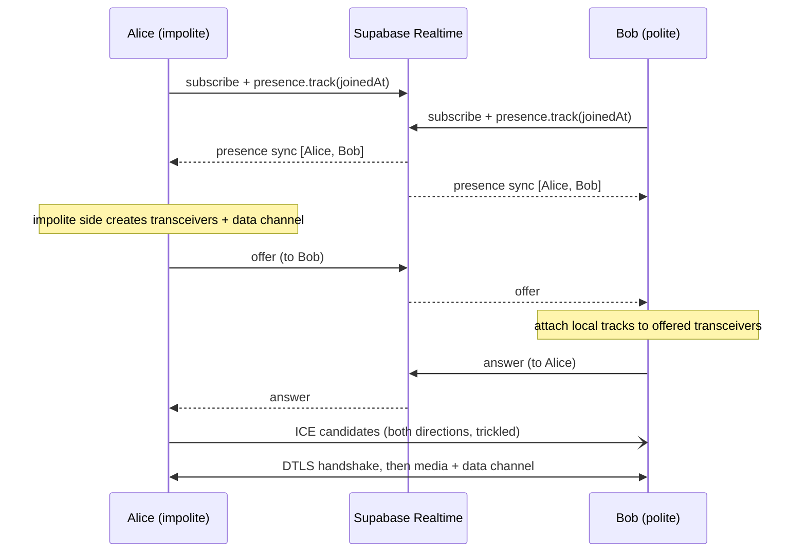

# Orbit: Implementation

This document explains how Orbit works: the architecture, how two browsers find each other and connect,
how media and chat flow, and how it is tested and deployed. Screenshots come from the live deployment
(`npm run screenshots`); the green frames are Chrome's synthetic test camera.

- [1. Goals](#1-goals)
- [2. User flow](#2-user-flow)
- [3. Architecture](#3-architecture)
- [4. Signaling with Supabase Realtime](#4-signaling-with-supabase-realtime)
- [5. Peer connection: perfect negotiation](#5-peer-connection-perfect-negotiation)
- [6. Media handling](#6-media-handling)
- [7. Data channel protocol](#7-data-channel-protocol)
- [8. NAT traversal: STUN and TURN](#8-nat-traversal-stun-and-turn)
- [9. UI layer](#9-ui-layer)
- [10. Error handling](#10-error-handling)
- [11. Testing](#11-testing)
- [12. Deployment](#12-deployment)
- [13. Debugging notes](#13-debugging-notes)
- [14. Limitations and next steps](#14-limitations-and-next-steps)

---

## 1. Goals

| Goal | Decision |
| --- | --- |
| 1:1 calls in the browser, no installs or accounts | WebRTC, shareable room links |
| No backend to run | Supabase Realtime for signaling, Netlify static hosting plus one function |
| Media never touches our servers | Peer-to-peer `RTCPeerConnection`, with TURN only as an encrypted relay |
| Small, readable codebase | Vanilla TypeScript + Vite, one module per responsibility |

## 2. User flow

### Landing

Create a new call or paste a code or link. Room codes look like `abc-defg-hjk` and use an alphabet without
look-alike characters (`0/o`, `1/l/i`), so they survive being read aloud.



### Lobby

Before joining, the user sees a mirrored camera preview, picks a camera and microphone, watches a live mic
level meter and sets a display name (remembered in `localStorage`). If only one of camera or microphone is
available, Orbit continues with the one that works.


### Waiting

The first participant sees the shareable link with a copy button.



### In call

The remote video fills the stage and the self-view floats in the corner. The bottom bar holds mic, camera,
screen share, chat and hang up, plus a call timer and the room code.


### Chat

Messages travel over the peer-to-peer data channel and vanish when the call ends.


### Remote camera off and muted

State changes are sent over the data channel, so the other side shows an avatar and a muted badge instead
of a frozen frame.



### Mobile and leaving

| Mobile (390×844) | After hanging up |
| --- | --- |
|  |  |

## 3. Architecture



### Module map

| File | Responsibility |
| --- | --- |
| `src/main.ts` | Router: config check, then landing, lobby, call and end screens |
| `src/config.ts` | Reads `VITE_*` env; default STUN; optional static TURN |
| `src/room.ts` | Room code generation, parsing codes and links |
| `src/roster.ts` | Pure function that decides who is in the call, who is turned away, and who is "polite" |
| `src/signaling.ts` | Supabase channel: presence roster and peer-addressed broadcast messages |
| `src/ice.ts` | Fetches TURN credentials from `/api/ice-servers`, with fallback |
| `src/peer.ts` | `PeerLink`: `RTCPeerConnection`, perfect negotiation, data channel, `replaceTrack` |
| `src/call-session.ts` | `CallSession`: ties signaling, roster, peer link and local media together for the UI |
| `src/media.ts` | `getUserMedia` / `getDisplayMedia`, device lists, level meter, friendly errors |
| `src/messages.ts` | Validated chat/state messages over the data channel |
| `src/ui/*` | Landing, lobby, call and message screens (plain DOM via a tiny `h()` helper) |
| `netlify/functions/ice-servers.mts` | Trades the Cloudflare TURN key for expiring credentials |

`CallSession` is the only thing the UI talks to. It exposes intent methods (`toggleMic`, `toggleCamera`,
`toggleScreenShare`, `sendChat`, `hangUp`) and reports back through handlers (`onStatus`,
`onRemoteStream`, `onRemoteInfo`, `onLocalMedia`, `onChat`, `onNotice`).

## 4. Signaling with Supabase Realtime

Each room is one Realtime channel, `orbit:<roomId>`. Nothing is persisted.

- **Presence** tracks `{ joinedAt }` under a random per-tab id. On every `sync`, `resolveRoster()` works out:
  - `waiting`: alone, or our own presence has not echoed back yet
  - `paired`: the peer id and whether we are the polite peer (`selfId < peerId`, so both sides agree without talking)
  - `full`: the first two by `joinedAt` (ties broken by id) own the room, and anyone else is shown "This call is full"
- **Broadcast** carries `{ from, to, payload }`, where the payload is an SDP description, an ICE candidate
  or `bye`. Receivers drop anything not addressed to them.



Robustness details in `CallSession`:

- **Signal-before-presence:** an offer can arrive before the offerer's presence shows up. The session
  connects to the sender instead of dropping the message.
- **Sticky pairing:** once paired, later roster changes (a third person arriving) never displace the current peer.
- **Departures:** `bye` (sent on hang-up and on `pagehide`) or the peer vanishing from presence closes the
  link and returns to "waiting". Departed ids are ignored from then on, so late candidates cannot resurrect them.

## 5. Peer connection: perfect negotiation

`PeerLink` follows the [perfect negotiation](https://developer.mozilla.org/en-US/docs/Web/API/WebRTC_API/Perfect_negotiation)
pattern (`makingOffer`, `ignoreOffer`, polite rollback), so either side can renegotiate, for example on an
ICE restart, without glare.

One design choice keeps the SDP minimal and avoids renegotiation entirely during a call:

- Only the **impolite** peer creates the audio and video transceivers and the data channel. That gives
  exactly one audio, one video and one data section.
- The **polite** peer waits for the offer, then binds its tracks to the transceivers the offer created
  (`direction = 'sendrecv'` + `replaceTrack`) before answering.
- After that, **every media change uses `sender.replaceTrack()`**: mute, camera off/on and screen share never renegotiate.

Incoming signals are processed through a promise queue so descriptions and candidates apply strictly in order.
On `connectionState === 'failed'` the link calls `restartIce()`.

Remote tracks start muted until RTP arrives. Orbit adopts a track into the remote `MediaStream` on `unmute`,
and emits a fresh stream so the `<video>` element always reflects the current tracks.

## 6. Media handling

| Action | Implementation |
| --- | --- |
| Join with partial devices | `acquireMedia` tries camera + mic, then mic only, then camera only, and reports the first real error |
| Mute | `track.enabled = false` (instant unmute, no permission prompt) |
| Camera off | `track.stop()` + `replaceTrack(null)`, so the camera light really turns off; a new track is requested on re-enable |
| Screen share | `getDisplayMedia` → `replaceTrack(screen)`; the browser's "Stop sharing" (`ended`) restores the camera |
| Device choice | Lobby selects use `deviceId: { exact }`; the chosen ids carry into the call |
| Level meter | `AudioContext` + `AnalyserNode` RMS every animation frame |

A single `busy` guard serializes camera, mic and screen operations so double clicks cannot race.

## 7. Data channel protocol

JSON messages over one ordered `RTCDataChannel` (`src/messages.ts`):

```ts
type PeerMessage =
  | { type: 'chat'; id: string; text: string; sentAt: number }
  | { type: 'state'; name: string; media: { audio: boolean; video: boolean; screen: boolean } };
```

- `state` is sent when the channel opens and after every media change. It drives the remote name tag,
  the muted badge, the camera-off avatar and the "presenting" label.
- Everything received is treated as untrusted. `decodeMessage` validates types, strips unknown fields,
  caps chat at 2000 characters and names at 40, and rejects blank messages. The UI only ever sets `textContent`.

## 8. NAT traversal: STUN and TURN

- **STUN** (Google, and Cloudflare via the function) lets peers discover their public address. That is
  enough for most home networks.
- **TURN** relays packets when no direct path exists. `/api/ice-servers` calls Cloudflare's
  `generate-ice-servers` API with a server-side token and returns credentials valid for 6 hours:
  - URLs on port 53 are filtered out, because browsers block them and they would only time out.
  - Requests whose `Origin` is not the Orbit site (or localhost) get `403`.
  - The client (`src/ice.ts`) validates the response and falls back to static STUN on error, missing
    config or a 4-second timeout.

## 9. UI layer

- No framework: a ~20-line `h(tag, props, ...children)` helper builds DOM nodes. Each screen is a
  `mount(container) → cleanup` function, and `main.ts` swaps screens.
- The call status is mirrored to `main.call[data-status]`, which drives CSS (spinner, status dot, overlay)
  and makes end-to-end tests easy to write.
- Accessibility: labelled buttons with `aria-pressed` state, `aria-live` toasts and chat, and keyboard shortcuts.
- Responsive: under 860px the lobby stacks, chat becomes a full-height sheet, the control bar centres, and
  `env(safe-area-inset-bottom)` keeps the controls clear of the iPhone home indicator.

## 10. Error handling

| Situation | What the user sees |
| --- | --- |
| Supabase env missing | Setup screen listing the missing variables |
| Signaling unreachable or timed out | "Could not join the call" with Rejoin |
| Camera/mic permission denied, missing or busy | Specific message in the lobby; can still join without that device |
| Third participant | "This call is full" |
| Peer leaves or closes the tab | Toast "Bob left the call", back to the waiting screen |
| Network drop | "Reconnecting…" overlay plus automatic ICE restart |
| Screen-share picker cancelled | Silently ignored |
| Chat before the data channel is open | Toast explaining chat is available once connected |

## 11. Testing

**Unit tests** (`npm test`, Vitest, 22 tests) cover the pure logic:

- `room.test.ts`: code format, no ambiguous characters, parsing codes and links, rejecting junk
- `roster.test.ts`: waiting, paired politeness symmetry, third participant turned away, tie-breaks, dedupe
- `messages.test.ts`: round-trips, malformed payloads, truncation, unknown fields stripped
- `config.test.ts`: missing env, default STUN, TURN parsing
- `ice.test.ts`: endpoint success, error, malformed data, timeout fallback

**End-to-end** (`npm run e2e`): two separate headless Chrome instances with synthetic camera and mic join
a random room on the deployed site and verify:

1. Alice joins and waits
2. Bob joins and both sides connect
3. Video flows both ways (640×360 frames decoded)
4. Audio tracks present both ways
5. Names exchanged over the data channel
6. Chat delivered
7. Mute shown remotely
8. Camera off shows the avatar, and camera on restores video
9. Hang up returns the other side to waiting

Typical run: connected about 2 s after Bob joins, all steps done in about 11 s.

## 12. Deployment

- **Netlify** builds with `npm run build` and publishes `dist/` (`netlify.toml`). The response headers set
  `Permissions-Policy` for camera, microphone and display capture, plus `nosniff` and a referrer policy.
- `VITE_SUPABASE_URL` and `VITE_SUPABASE_ANON_KEY` are inlined at build time (public by design).
  `CF_TURN_KEY_ID` and `CF_TURN_API_TOKEN` are runtime-only secrets for the function.
- `vite.config.ts` allows Cloudflare and ngrok tunnel hostnames for quick sharing of dev and preview servers.

## 13. Debugging notes

The first end-to-end run on the live site failed in an instructive way: signaling was perfect (offer,
answer and every candidate arrived), yet both sides sat in "Connecting…".

1. **Instrumented `RTCPeerConnection`** in the test browsers. Every candidate pair stayed `in-progress`
   and never succeeded, even between two tabs on the same laptop over the LAN address.
2. **Isolated the app** with a bare two-peer loopback in a blank page. Host-only candidates always failed,
   and with STUN it passed only 2 out of 3 times. So the network, not Orbit, was dropping connectivity checks.
3. **Root cause:** the machine runs **Cloudflare WARP** (a `utun0` tunnel on `100.96.x.x`, with Cloudflare
   egress addresses), which interferes with peer-to-peer UDP.
4. **Fix:** added Cloudflare TURN through a Netlify function. The test went from 0/1 to 15/15 checks,
   three runs in a row, with WARP still on.

The same test then caught two UI bugs:

- Netlify's injected **"Powered by Netlify" badge** covered the chat button on desktop and the hang-up
  button on mobile. The chat button moved into the central controls, the mobile bar is now centred, and
  the badge is disabled for the project.
- A missing mobile layout rule left the control bar off-centre on phones.

## 14. Limitations and next steps

- **1:1 only.** Group calls would need a mesh (fine up to about 4 people) or an SFU such as Cloudflare Calls or LiveKit.
- **No authentication on rooms.** Knowing the link is the only requirement. Options: host approval ("knock"), or signed room tokens.
- **Credential refresh.** TURN credentials last 6 hours; calls longer than that would need `setConfiguration()` with fresh credentials.
- Possible features: in-call device switching, background blur, recording, adaptive bitrate hints, and a call quality indicator from `getStats()`.
