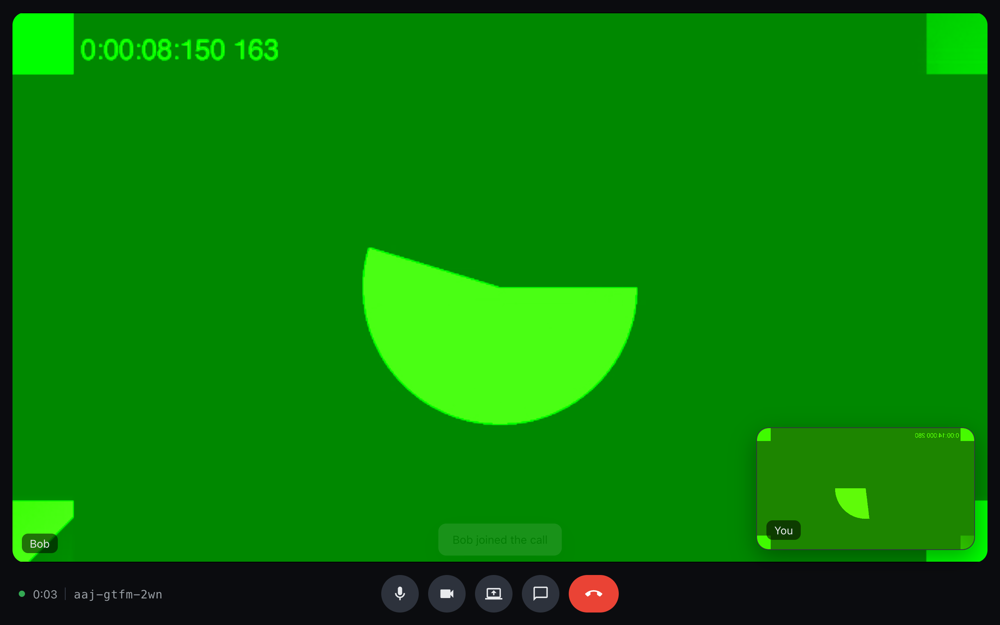
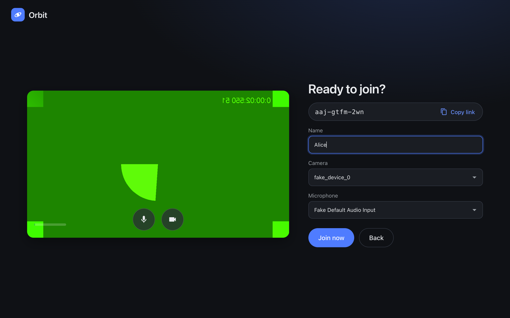
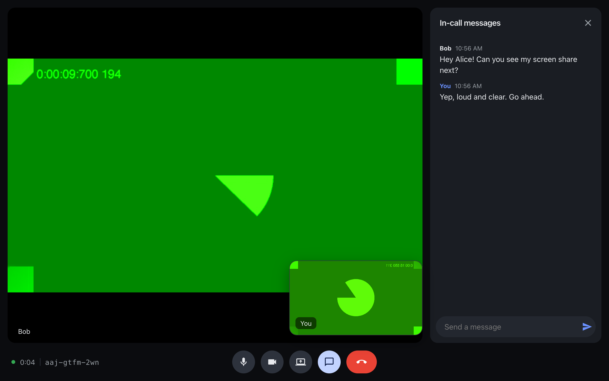
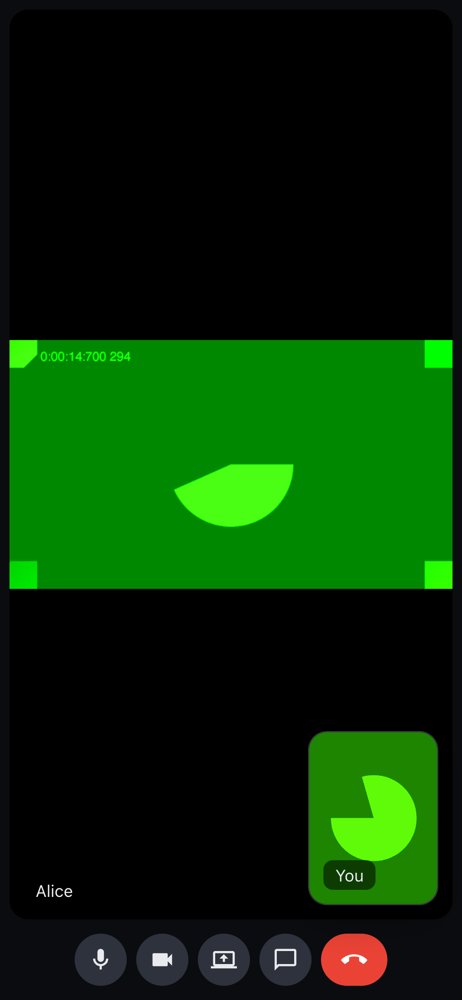

# Orbit

**Private 1:1 video calls, straight between browsers.**

**Live:** <https://orbitcall.netlify.app> · **How it's built:** [IMPLEMENTATION.md](IMPLEMENTATION.md)



Orbit is a WebRTC video calling app with no accounts and no installs. Audio, video, screen share and chat
travel **peer-to-peer** between the two browsers. [Supabase Realtime](https://supabase.com/docs/guides/realtime)
is used only so the browsers can find each other (signaling), and a [Cloudflare TURN](https://developers.cloudflare.com/realtime/turn/)
relay steps in when a network blocks direct connections. Nothing is stored in a database.

## Features

- **Shareable room links:** `?room=abc-defg-hjk`, Meet-style codes without look-alike characters
- **Pre-join lobby:** camera preview, camera/microphone pickers, live mic level meter, display name
- **Call controls:** mute, camera on/off (really releases the camera), hang up; `⌘/Ctrl+D` and `⌘/Ctrl+E` shortcuts
- **Screen sharing:** swaps the outgoing video track in place, no renegotiation
- **In-call chat:** peer-to-peer over an `RTCDataChannel`, with unread badge and toasts
- **Presence cues:** remote mute, camera-off avatar and "presenting" label
- **Resilience:** automatic ICE restart, TURN fallback (UDP/TCP/TLS 443), "room is full" for a third person, "the other person left"
- **Responsive:** works on phones and desktops

| Lobby | Chat | Mobile |
| --- | --- | --- |
|  |  |  |

## Quick start

```bash
npm install
cp .env.example .env   # add your Supabase URL + publishable/anon key
npm run dev            # http://localhost:5173
```

Open the app, click **New call**, then open the same link in a second browser or device.

Browsers only allow camera/microphone access on `https://` or `http://localhost`.

### Supabase (signaling)

1. Create a free project at <https://supabase.com/dashboard>.
2. **Project Settings → API**: copy the **Project URL** and the **publishable** (or legacy **anon**) key into `.env`.
3. **Realtime → Settings**: make sure **Allow public access** is on (the default).

No tables or migrations are needed.

### Cloudflare TURN (relay, recommended)

VPNs such as Cloudflare WARP, corporate firewalls and many mobile networks block direct peer-to-peer traffic.
Orbit's Netlify function `/api/ice-servers` exchanges a Cloudflare TURN key for credentials that expire after
6 hours, so the key never reaches the browser.

1. Cloudflare dashboard → **Realtime → TURN Server → Create**.
2. Set these as Netlify environment variables (not `VITE_`-prefixed, so they stay server-side):

```bash
CF_TURN_KEY_ID=...
CF_TURN_API_TOKEN=...
```

Without them (or under plain `npm run dev`), Orbit falls back to public STUN plus any static TURN server in `.env`.
Use `netlify dev` to run the function locally.

## Scripts

| Command | What it does |
| --- | --- |
| `npm run dev` | Vite dev server |
| `npm run build` | Typecheck + production build into `dist/` |
| `npm test` | Unit tests (Vitest) |
| `npm run e2e` | Two headless Chrome instances hold a real call on the deployed site (`BASE_URL` to override) |
| `npm run screenshots` | Regenerates `docs/screenshots` from the deployed site |

## Deploy (Netlify)

```bash
netlify sites:create --name <your-name>
netlify env:set VITE_SUPABASE_URL ...
netlify env:set VITE_SUPABASE_ANON_KEY ...
# plus CF_TURN_KEY_ID / CF_TURN_API_TOKEN for TURN
netlify deploy --prod
```

`netlify.toml` holds the build command, publish directory and camera/microphone permission headers.

## Tech

TypeScript + Vite (no UI framework), WebRTC, Supabase Realtime (presence + broadcast), Netlify Functions,
Cloudflare TURN, Vitest and Puppeteer.

## Security notes

- Anyone with a room link can join while a slot is free. Codes are random (~8×10¹⁴ combinations).
- Media is always encrypted by WebRTC (DTLS-SRTP) and never passes through Supabase. TURN relays forward
  encrypted packets without being able to read them.
- The Supabase publishable key is designed to be public. The Cloudflare TURN token lives only in Netlify's server environment.
